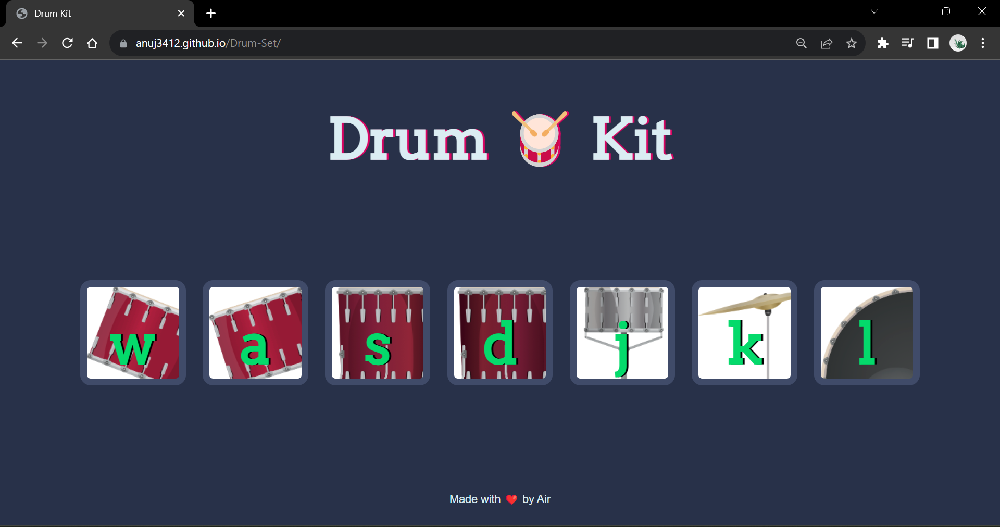

# Drum Set Website

Welcome to the Drum Set website! This web application allows you to play virtual drums using your computer's keyboard or by clicking on the drum pads.

## Technologies Used

This website was built using the following technologies:

- **HTML5**: The structure of the web pages.
- **CSS3**: The styling and layout of the website.
- **JavaScript**: The interactive drumming functionality.
- **GitHub Pages**: Hosting the website online.

## Features

- Play virtual drums using your keyboard keys or by clicking on the drum pads.
- Enjoy realistic drum sounds and visual feedback.
- Responsive design for a seamless experience on various devices.

## Live Demo

You can try out the Drum Set website by visiting the [Live Demo](https://anuj3412.github.io/Drum-Set/).

## How to Use

1. Simply visit the [Live Demo](https://anuj3412.github.io/Drum-Set/) link.

2. To play the drums:
   - Use your computer keyboard keys (A, S, D, F, G, H, J, K, and L) to hit different drums.
   - Alternatively, click on the drum pads using your mouse.

3. Enjoy making music and have fun!

---

Enjoy playing the drums on the Drum Set website! If you have any questions, feedback, or would like to contribute, please don't hesitate to reach out.

